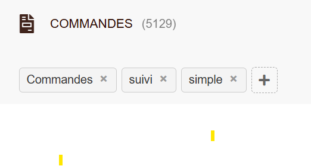

# SavedViews — saved list views for Dolibarr

🇫🇷 [Version française](README.fr.md)

SavedViews adds a bar of bookmark tabs above every Dolibarr list page. Each user can save the current view — search filters, selected columns, list/kanban display mode — under a name, and reopen it later in one click.

## Features

- One-click save of the current list state: filters, visible columns, display mode (list/kanban)
- Views are **per user** and **per list** (a view saved on the invoice list only shows on the invoice list; lists sharing a URL, such as products vs services or customers vs prospects, are kept separate)
- Works on **all** Dolibarr list pages, native and from third-party modules — no per-list configuration
- Multi-entity aware (views are scoped to the current entity)
- No core file modified; pure hook (`printCommonFooter`) + one small table

## Requirements

- Dolibarr >= 16.0
- PHP >= 7.0

## Install

1. Unzip into `htdocs/custom/` (or deploy through *Home → Setup → Modules → Deploy an external module*)
2. Enable **SavedViews** in the module list
3. Open any list page: a `+` button appears under the page title — set your filters/columns, click `+`, name the view

> **Upgrading from 1.0.x**: version 1.1.0 introduces permissions. They are inserted into `llx_rights_def` when the module is enabled, so disable then re-enable SavedViews, then grant the two rights to your users or groups.

## Permissions

| Right | Grants |
|-------|--------|
| `read` | See the saved view tabs and apply them |
| `create` | Save a new view, rename it, delete one of its own views |

Both are granted by default to newly created users, and to admin users when the module is enabled. Without `read` the module injects nothing at all; without `create` the tabs are read-only (no `+` button, no delete cross). Every AJAX action re-checks the right server-side, and a view can only ever be updated or deleted by the user it belongs to.

Note on per-list access: a saved view holds nothing but the search parameters of a page the user was already allowed to open, and applying one is a plain redirect to that URL — so Dolibarr's own page-level permission check still governs what the user can actually see.

## How it works

The module hooks `printCommonFooter` (context `all`) and injects a small JS/CSS payload. The JS only activates when the page is an actual list (presence of the `searchFormList` form). Views are stored in `llx_savedviews` (per user, per entity, keyed on the page path plus its `type` discriminator). Applying a view redirects to the saved same-origin URL with all filter parameters.

AJAX exchanges use the response shape of the core `JsonResponse` class (`result`, `msg`, `newToken`, `data`); the class itself is used when the Dolibarr version provides it (>= 24), with an identical fallback payload on older versions.

## License

GPL v3+. See COPYING.
